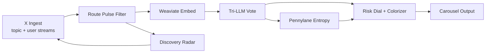
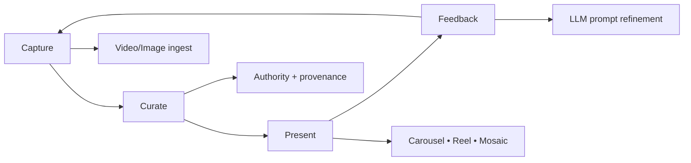
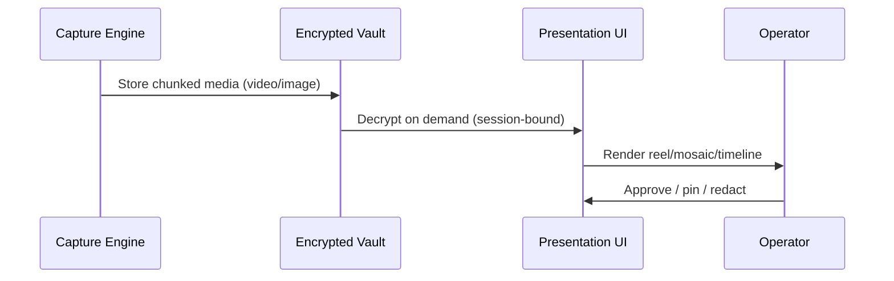
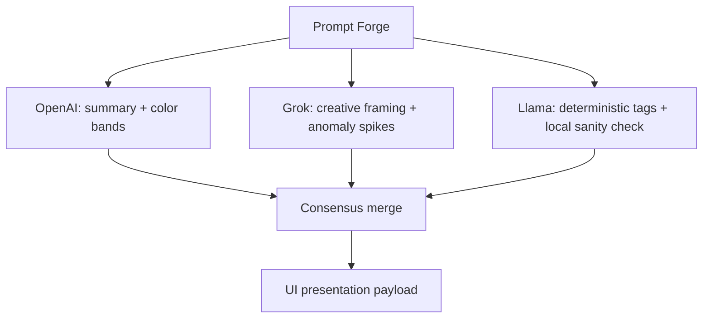
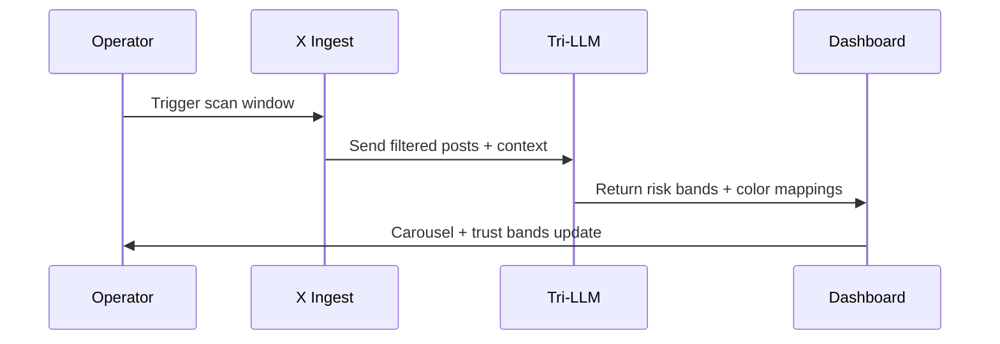

# X Feed New Ideas (Pipeline Notes)

This document tracks forward-looking concepts that were previously surfaced on the X dashboard UI. It keeps the system coherent by pairing the ideas with mermaid diagrams that show how each concept slots into the pipeline.

## Overview Map

## Ideas Backlog (Scoped)

```mermaid
flowchart TB
  subgraph Signals["Signal Quality + Trust"]
    Pulse["Route pulse matching"] --> Trust["Hazard authority weighting"]
    Trust --> Decay["Signal decay lanes"]
  end

  subgraph UX["Driver Experience"]
    Calm["Driver calm mode"] --> Bands["Color trust bands"]
    Bands --> Carousel["Carousel tuning"]
  end

  subgraph Vector["Vector + Retrieval"]
    Weaviate["Weaviate weave"] --> Clusters["Cluster recall"]
  end

  subgraph Capture["Capture + Throughput"]
    Grabber["Post grabber phases"] --> Throttle["Burst throttling"]
  end

  subgraph Quantum["Quantum Signals"]
    Drift["Pennylane signal drift"] --> Entropy["Entropy confidence gate"]
  end

  subgraph Presentation["Post Presentation + Media"]
    Story["Story reels (short clips + captions)"] --> Mosaic["Mosaic wall (image grid)"]
    Mosaic --> Timeline["Context timeline (before/after)"]
    Timeline --> Vault["Encrypted media vault"]
  end
```

## Implementation Notes

- **Route pulse matching**: boost posts that mention active corridor or waypoints, then push into the risk dial before tri-LLM voting.
- **Hazard authority weighting**: score higher when the post cites DOT, weather, or responder sources.
- **Signal decay lanes**: auto-archive as posts age; keep a “recent alerts” shelf for live alerts.
- **Driver calm mode**: soften language + color for high-stress windows to reduce panic.
- **Weaviate weave**: embed every post + risk snapshot into a vector lattice for clustering and retrieval.
- **Post grabber phases**: stagger searches by corridor to reduce API burst pressure.
- **Pennylane signal drift**: use quantum entropy to detect low-confidence bursts.
- **Color trust bands**: apply risk-aware palettes to minimize alert fatigue.
- **Story reels**: turn top posts into short video tiles with captions, timestamps, and audio-off defaults.
- **Mosaic wall**: grid of images pulled from trusted sources with quick zoom + provenance.
- **Context timeline**: show “before/after” posts when a hazard evolves (first report → peak → resolved).
- **Encrypted media vault**: store video/image chunks per user and surface them only in secure views.

## New Ideas (Expanded)

- **Clip stacker**: stitch short clips into a “risk reel” with animated severity bands.
- **Image diffing**: compare satellite/road images over time to highlight changes.
- **Avatar overlays**: show tri-model avatar reactions as color bands on each post.
- **Safe preview**: blur thumbnails by default; click to reveal with safety tag.
- **Multi-angle view**: group posts by angle (official, eyewitness, media, automated).
- **Evidence pinboard**: pin related posts to a board with source links + timestamps.
- **Audio captions**: generate short spoken summaries for hands-free review (muted by default).
- **Timewarp scrubber**: timeline slider to replay risk evolution hour-by-hour.

## Media & Presentation Blueprint

- **Reel mode**: auto-compose 12–18 second reels with captions, timestamps, and safety bands.
- **Mosaic mode**: cluster images by similarity + trust level, with badges for source authority.
- **Timeline mode**: event progression panel with “first report → peak → resolution” anchors.
- **Secure preview**: blur sensitive media until operator confirms intent to reveal.
- **Trust overlay**: add a thin “trust strip” above media cards reflecting verified/heuristic scoring.

## Prompt Extensions (Tri‑LLM)

- **Visual palette prompt**: generate per-post palette with “primary/accent/glow” + rationale.
- **Media caption prompt**: 1–2 sentence captions optimized for reel overlays.
- **Clip storyboard prompt**: turn a set of posts into a 5‑scene storyboard with risk beats.
- **Diff explain prompt**: for image diffing, summarize what changed and why it matters.

## Trust & Safety Enhancements

- **Source watermarking**: watermark tiles by authority category (official, responder, media, eyewitness).
- **Cross‑signal corroboration**: only elevate to “verified” when two independent sources align.
- **Redaction masks**: auto-mask faces/plates using post metadata flags (no local image processing).
- **Audit trail**: record every media reveal action to a minimal log for accountability.

## Validation Notes

> Tip: Set `RGN_X_TEST_API=synthetic` or a test URL to inject synthetic feed data for validation while tuning these ideas.
