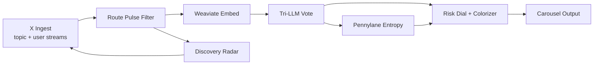
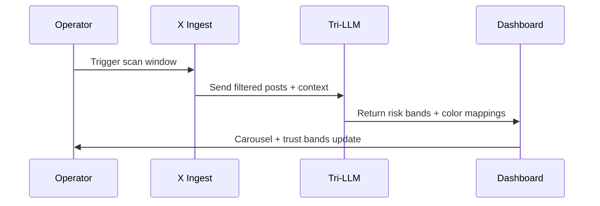

# X Feed New Ideas (Pipeline Notes)

This document tracks forward-looking concepts that were previously surfaced on the X dashboard UI. It keeps the system coherent by pairing the ideas with mermaid diagrams that show how each concept slots into the pipeline.

## Overview Map

## Ideas Backlog (Scoped)

```mermaid
flowchart TB
  subgraph Signals["Signal Quality + Trust"]
    Pulse["Route pulse matching"] --> Trust["Hazard authority weighting"]
    Trust --> Decay["Signal decay lanes"]
  end

  subgraph UX["Driver Experience"]
    Calm["Driver calm mode"] --> Bands["Color trust bands"]
    Bands --> Carousel["Carousel tuning"]
  end

  subgraph Vector["Vector + Retrieval"]
    Weaviate["Weaviate weave"] --> Clusters["Cluster recall"]
  end

  subgraph Capture["Capture + Throughput"]
    Grabber["Post grabber phases"] --> Throttle["Burst throttling"]
  end

  subgraph Quantum["Quantum Signals"]
    Drift["Pennylane signal drift"] --> Entropy["Entropy confidence gate"]
  end
```

## Implementation Notes

- **Route pulse matching**: boost posts that mention active corridor or waypoints, then push into the risk dial before tri-LLM voting.
- **Hazard authority weighting**: score higher when the post cites DOT, weather, or responder sources.
- **Signal decay lanes**: auto-archive as posts age; keep a “recent alerts” shelf for live alerts.
- **Driver calm mode**: soften language + color for high-stress windows to reduce panic.
- **Weaviate weave**: embed every post + risk snapshot into a vector lattice for clustering and retrieval.
- **Post grabber phases**: stagger searches by corridor to reduce API burst pressure.
- **Pennylane signal drift**: use quantum entropy to detect low-confidence bursts.
- **Color trust bands**: apply risk-aware palettes to minimize alert fatigue.

## Validation Notes

> Tip: Set `RGN_X_TEST_API=synthetic` or a test URL to inject synthetic feed data for validation while tuning these ideas.
